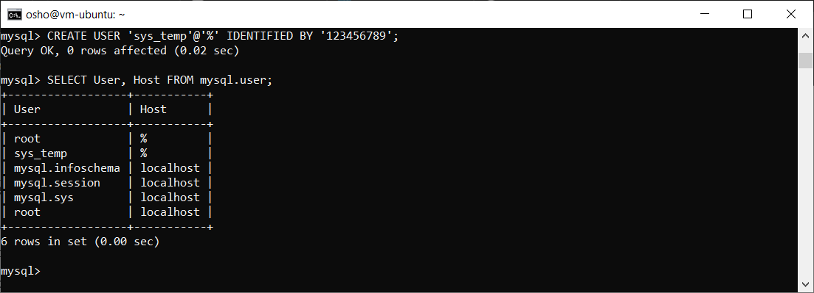
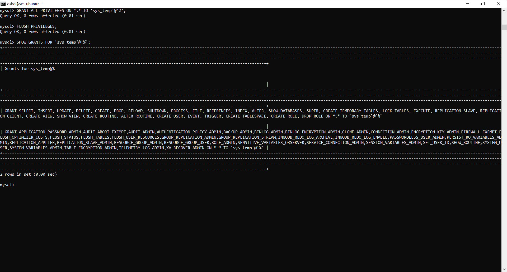
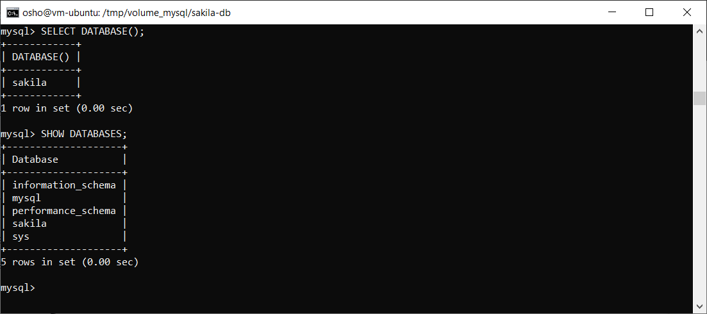
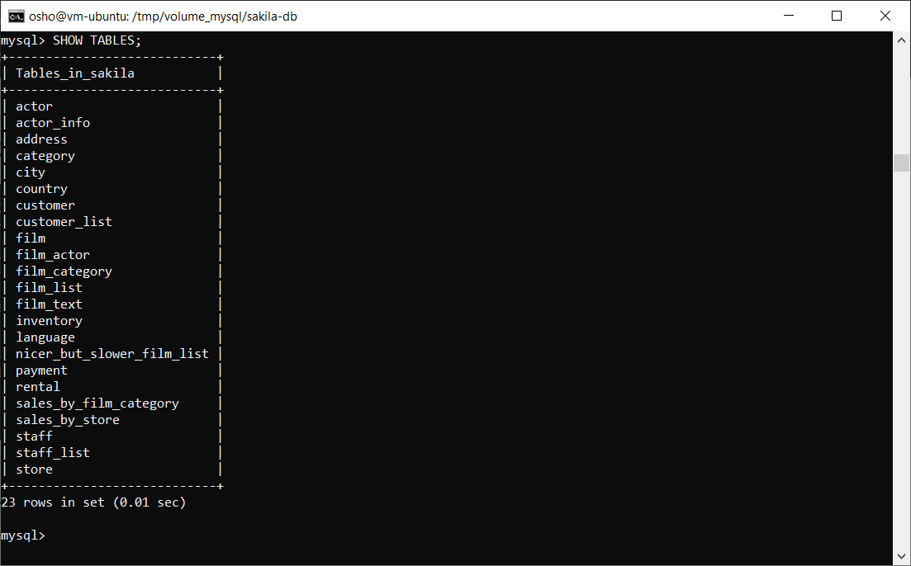
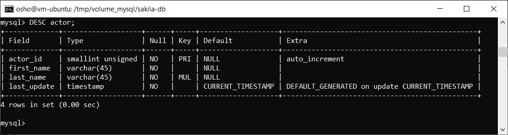
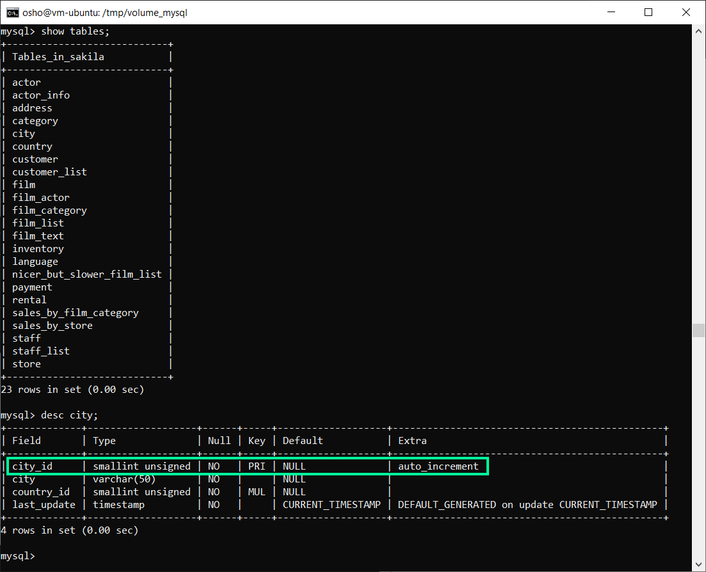
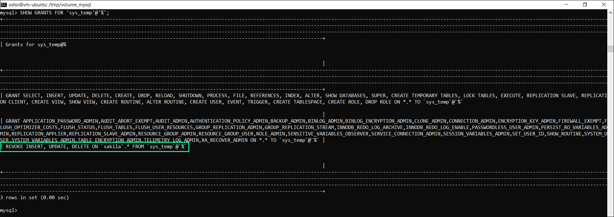

# Домашнее задание к занятию «Работа с данными (DDL/DML)»

Задание можно выполнить как в любом IDE, так и в командной строке.

### Задание 1
1.1. Поднимите чистый инстанс MySQL версии 8.0+. Можно использовать локальный сервер или контейнер Docker.

1.2. Создайте учётную запись sys_temp. 

1.3. Выполните запрос на получение списка пользователей в базе данных. (скриншот)

1.4. Дайте все права для пользователя sys_temp. 

1.5. Выполните запрос на получение списка прав для пользователя sys_temp. (скриншот)

1.6. Переподключитесь к базе данных от имени sys_temp.

Для смены типа аутентификации с sha2 используйте запрос: 
```sql
ALTER USER 'sys_test'@'localhost' IDENTIFIED WITH mysql_native_password BY 'password';
```
1.6. По ссылке https://downloads.mysql.com/docs/sakila-db.zip скачайте дамп базы данных.

1.7. Восстановите дамп в базу данных.

1.8. При работе в IDE сформируйте ER-диаграмму получившейся базы данных. При работе в командной строке используйте команду для получения всех таблиц базы данных. (скриншот)

*Результатом работы должны быть скриншоты обозначенных заданий, а также простыня со всеми запросами.*

### Решение 1

1.1 Запущен Docker контейнер MySQL:

```
docker run -d \
    --name mysql \
    -e MYSQL_ROOT_PASSWORD=12345 \
    -v /tmp/volume_mysql:/share \
    mysql:8.0.45-debian
```

1.2 Создание пользователя **sys_temp**:

```sql
CREATE USER 'sys_temp'@'%' IDENTIFIED BY '123456789';
```

1.3 Увидеть информацию о пользователях, которая хранится в системной таблице **user** базы данных **mysql**:

```sql
SELECT User, Host FROM mysql.user;
```



1.4 Выдать все права для пользователя **sys_temp**:

```sql
GRANT ALL PRIVILEGES ON *.* TO 'sys_temp'@'%';
```

Применить (обновить кеш прав):

```sql
FLUSH PRIVILEGES;
```

1.5 Запрос на получение списка прав для пользователя:

```sql
SHOW GRANTS FOR 'sys_temp'@'%';
```



1.6.1 Вход в **MySQL** под пользователем **sys_temp**:

```
docker exec -it mysql mysql -u sys_temp -p 
```

1.6.2 Скачан дамп базы данных и проброшен в контейнер в директорию */share/sakila-db/*:

```
/tmp/volume_mysql/sakila-db/
├── sakila-data.sql
├── sakila.mwb
└── sakila-schema.sql
```

1.7 Восстановление дампа в базу данных:

> [!WARNING]
> Сначала нужно запускать **sakila-schema.sql** (структура таблиц), а потом данные **sakila-data.sql** (данные).
> Если при импорте данных ошибок не было, значит таблицы уже существовали.

```sql
SOURCE /share/sakila-db/sakila-schema.sql;
```

```sql
SOURCE /share/sakila-db/sakila-data.sql;
```

1.8 Проверить список баз данных:

```sql
SHOW DATABASES;
```



Просмотр списка таблиц:

```sql
SHOW TABLES;
```



Просмотр поля actor:

```sql
DESC actor;
```



### Задание 2
Составьте таблицу, используя любой текстовый редактор или Excel, в которой должно быть два столбца: в первом должны быть названия таблиц восстановленной базы, во втором названия первичных ключей этих таблиц. Пример: (скриншот/текст)
```
Название таблицы | Название первичного ключа
customer         | customer_id
```

### Решение 2



Запрос чтобы узнать первичный ключ таблиц в базе данных sakila:

```sql
SELECT 
    TABLE_NAME, 
    COLUMN_NAME
FROM 
    information_schema.COLUMNS 
WHERE 
    TABLE_SCHEMA = 'sakila' 
    AND COLUMN_KEY = 'PRI'
ORDER BY 
    TABLE_NAME;
```

Вывод запроса:

```
+---------------+--------------+
| TABLE_NAME    | COLUMN_NAME  |
+---------------+--------------+
| actor         | actor_id     |
| address       | address_id   |
| category      | category_id  |
| city          | city_id      |
| country       | country_id   |
| customer      | customer_id  |
| film          | film_id      |
| film_actor    | actor_id     |
| film_actor    | film_id      |
| film_category | category_id  |
| film_category | film_id      |
| film_text     | film_id      |
| inventory     | inventory_id |
| language      | language_id  |
| payment       | payment_id   |
| rental        | rental_id    |
| staff         | staff_id     |
| store         | store_id     |
+---------------+--------------+
```

|**TABLE_NAME**|**COLUMN_NAME**|
|:-:|:-:|
|actor|actor_id|
|address|address_id|
|category|category_id|
|city|city_id|
|country|country_id|
|customer|customer_id|
|film|film_id|
|film_actor|actor_id|
|film_actor|film_id|
|film_category|category_id|
|film_category|film_id|
|film_text|film_id|
|inventory|inventory_id|
|language|language_id|
|payment|payment_id|
|rental|rental_id|
|staff|staff_id|
|store|store_id|

### Задание 3
3.1. Уберите у пользователя sys_temp права на внесение, изменение и удаление данных из базы sakila.

3.2. Выполните запрос на получение списка прав для пользователя sys_temp. (скриншот)

*Результатом работы должны быть скриншоты обозначенных заданий, а также простыня со всеми запросами.*

### Решение 3

> [!TIP]
> В новых версиях **MySQL** (Только для **MySQL 8.0+**) появилась системная переменная `partial_revokes`. Если её включить, то команда сработает при глобальных настройках:

```sql
SET GLOBAL partial_revokes = ON;
```

Проверка:

```sql
SHOW VARIABLES LIKE 'partial_revokes';
```

3.1 Убрать у пользователя **sys_temp** права на внесение, изменение и удаление данных из базы **sakila**:

```sql
REVOKE INSERT, UPDATE, DELETE ON sakila.* FROM 'sys_temp'@'%';
```

3.2 Запрос на получение списка прав для пользователя **sys_temp**:

```sql
SHOW GRANTS FOR 'sys_temp'@'%';
```

